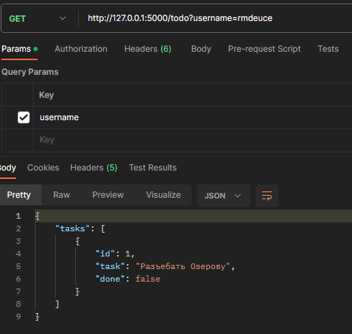

# Flask + SQLAlchemy todo web app using json RestAPI server
```
# write this to command prompt in directory of the project
python run.py
```
<h2> POST запрос добавления пользователя</h2>


<h2> POST запрос добавления уже существующего пользователя</h2>


<h2> GET запрос получение списка задач задачи</h2>



<h2> GET запрос получение списка задач для несуществующего пользователя</h2>


<h2> POST запрос добавления задачи пользователя</h2>


<h2> DELETE запрос удаления задачи пользователя</h2>


<h2> PUT запрос обновления задачи пользователя</h2>


