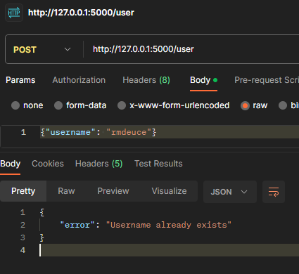

# Flask + SQLAlchemy todo web app using json RestAPI server
```
# write this to command prompt in directory of the project
python run.py
```
<h2> POST запрос добавления пользователя</h2>

<h2> POST запрос добавления уже существующего пользователя</h2>
